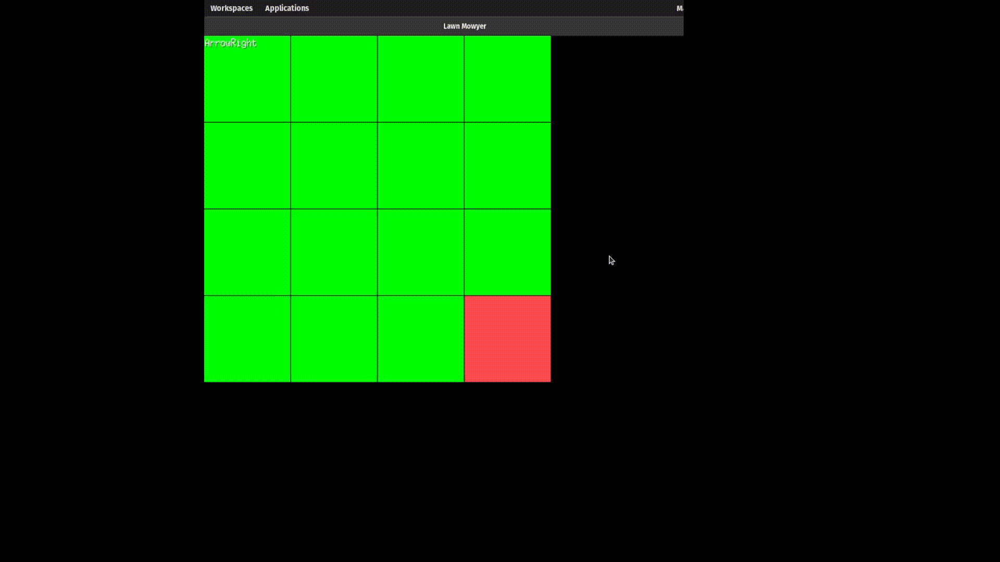

# Lawn Mowyer
### Puzzle game to cut your lawn
## Run the game
`go run github.com/tjvaughn/lawnmowyer@latest`

#### Current Status:

## Core loop
Cut the lawn, avoid obstacles, don't cut the same lawn twice

### Project Goal
Create a small game using golang

#### Scope:
- intro screen
- 10 puzzles
- if user cuts same piece twice, puzzle failed

### Dependencies
- Go >= v1.26.0
- Ebiten

Packages:
- [linux](https://ebitengine.org/en/documents/install.html?os=linux)
- [mac](https://ebitengine.org/en/documents/install.html?os=darwin)
- [win](https://ebitengine.org/en/documents/install.html?os=windows)
